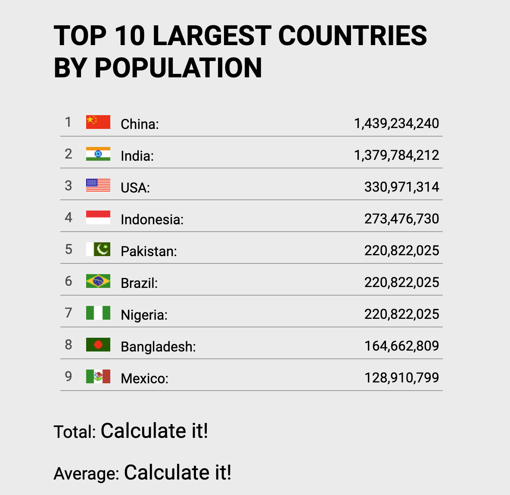

1. Replace `<your_account>` with your Github username in the link
    - [DEMO LINK](https://Dyakovich-R.github.io/js_get_data_DOM/)
2. Follow [this instructions](https://mate-academy.github.io/layout_task-guideline/)
    - There are no tests for this task so use `npm run lint` command instead of `npm test`

### Task: TOP 10 LARGEST COUNTRIES BY POPULATION

<!--Привіт!У цьому завданні вам потрібно проаналізувати дані зі списку, а виходячи з нього, отримувати середню та загальну вартість.
Не потрібно змінювати стилі або макет HTML у цьому завданні.Змінити лише `file.js` файл.

Кроки для цього виклику:
1. Отримайте всі текстові дані від `span` з класом` населення '
2. Переконайтесь, що заданий рядок може бути перетворений на число і перетворити його на номер.
3. Обчисліть середню та загальну вартість на основі розбору чисел.
4. Замініть `Обчисліть його!` За допомогою обчислених середніх чисел у `span` на класах` середня населення 'та `загальна популяція'.
5. Обчислені числа `` `` `` загальні `` повинні бути відокремлені [тисячами сепаратора] (https://chortle.ccsu.edu/java5/notes/chap24b/ch24b_9.html) (такий же числовий стиль, що і представлені популяції).
6. Вітаємо, товариш!Ти зробив це!-->

.
